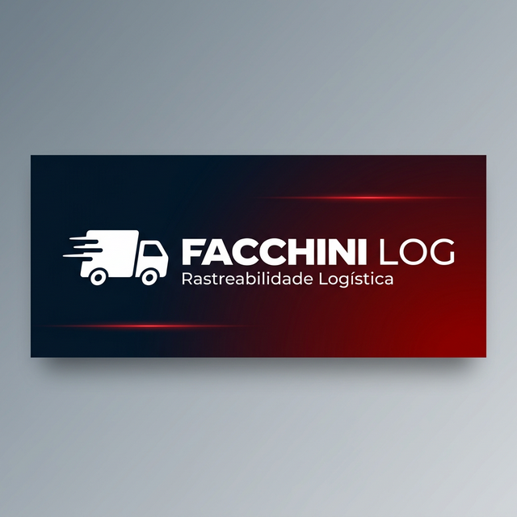

# 

<div align="center">


**Sistema de rastreabilidade logística com leitura de QR Code para controle de despacho e recebimento de cargas entre filiais.**

[Funcionalidades](#-funcionalidades) •
[Como Funciona](#-como-funciona) •
[Instalação](#-instalação) •
[Arquitetura](#-arquitetura) •
[API](#-endpoints-da-api) •
[Licença](#-licença)

</div>

---

## 📋 Sobre o Projeto

O **Facchini LOG** é uma aplicação web leve e responsiva para **rastreabilidade logística de ponta a ponta**. Desenvolvida para operar em ambientes de expedição, a aplicação permite o controle total do ciclo de vida de pacotes — desde a leitura na origem até a confirmação de recebimento no destino final.

O sistema funciona **sem banco de dados SQL**, utilizando persistência local em arquivo JSON com controle de concorrência via `flock()`, garantindo segurança para múltiplos dispositivos simultâneos.

---

## ✨ Funcionalidades

- 📱 **Leitura de QR Code / Código de Barras** — Via câmera do dispositivo ou leitor físico
- 🟢🟡🔴 **Sistema de Semáforo (3 Estados)** — Origem → Trânsito → Destino Final
- 📧 **Envio de Relatório por E-mail** — Despacho automático para a filial selecionada
- 🏢 **Seleção de 25+ Filiais** — Com busca e filtro por estado
- ⏱️ **Auto-refresh** — Lista de itens atualiza automaticamente a cada 10 segundos
- 🔒 **Thread-safe** — Controle de concorrência com `flock()` para múltiplos coletores
- 📝 **Observação Obrigatória** — Registro de condição do produto no recebimento
- 🗑️ **Gestão de Itens** — Exclusão individual ou limpeza total com confirmação
- 🎨 **UI Premium** — Splash screen com carrossel, animações e design responsivo

---

## 🚦 Como Funciona

O produto percorre 3 estados obrigatórios em sequência:

```
┌──────────────┐      ┌──────────────────┐      ┌──────────────────┐
│  🟢 ORIGEM   │ ───► │  🟡 EM TRÂNSITO  │ ───► │  🔴 RECEBIDO     │
│  (Status 1)  │      │    (Status 2)    │      │    (Status 3)    │
│              │      │                  │      │                  │
│ Pacote lido  │      │ Despacho para    │      │ Confirmação de   │
│ na expedição │      │ filial destino   │      │ chegada + obs.   │
└──────────────┘      └──────────────────┘      └──────────────────┘
```

| Etapa | Ação do Operador | O que o Sistema Faz |
|-------|-----------------|---------------------|
| **Origem** | Escaneia o pacote | Salva com status 1, marca `created_at` |
| **Trânsito** | Clica "Finalizar e Enviar" + seleciona destino | Transiciona em lote para status 2, envia e-mail |
| **Destino** | Escaneia o pacote novamente na filial destino | Detecta trânsito, abre modal de confirmação com observação |

---

## 🚀 Instalação

### Pré-requisitos

- [XAMPP](https://www.apachefriends.org/) (Apache + PHP 8.0+)
- [Composer](https://getcomposer.org/)

### Passo a Passo

```bash
# 1. Clone o repositório na pasta htdocs do XAMPP
cd C:\xampp\htdocs
git clone https://github.com/Arth-t-carvalho/projeto-Facchini.git

# 2. Instale as dependências do backend
cd projeto-Facchini/backend
composer install

# 3. Configure o arquivo .env (para envio de e-mails)
cp .env.example .env
# Edite o .env com suas credenciais SMTP
```

### Configuração de E-mail (.env)

```env
MAIL_HOST=smtp.gmail.com
MAIL_PORT=587
MAIL_USERNAME=seu-email@gmail.com
MAIL_PASSWORD=sua-senha-de-app
MAIL_FROM=seu-email@gmail.com
MAIL_FROM_NAME=Facchini Logística
```

### Acesso

Inicie o Apache no XAMPP e acesse:

```
http://localhost/projeto-Facchini/frontend/index.html
```

---

## 🏗️ Arquitetura

O projeto segue o padrão **Clean Architecture** no backend com separação clara de responsabilidades:

```
projeto-Facchini/
├── frontend/
│   ├── index.html              # Página principal (SPA-like)
│   ├── css/
│   │   └── style.css           # Estilos completos do sistema
│   ├── js/
│   │   └── app.js              # Lógica do frontend (fetch API, câmera, modais)
│   └── assets/
│       └── carousel/           # Imagens do carrossel da splash screen
│
├── backend/
│   ├── public/
│   │   └── index.php           # Entry point + Router
│   ├── app/
│   │   ├── Domain/
│   │   │   ├── Model/
│   │   │   │   └── CollectedItem.php       # Entidade com regras de transição
│   │   │   └── Repository/
│   │   │       └── CollectedItemRepository.php  # Interface do repositório
│   │   ├── Application/
│   │   │   └── Service/
│   │   │       ├── CollectItemService.php   # Lógica de coleta e recepção
│   │   │       └── ReportService.php        # Despacho + envio de e-mail
│   │   ├── Infrastructure/
│   │   │   ├── Persistence/
│   │   │   │   └── JsonCollectedItemRepository.php  # Persistência JSON + flock
│   │   │   └── Email/
│   │   │       └── PHPMailerEmailSender.php # Integração PHPMailer
│   │   └── Presentation/
│   │       └── Controller/
│   │           └── CollectController.php    # Controller HTTP
│   ├── data/
│   │   └── items.json          # "Banco de dados" JSON
│   └── composer.json
│
└── README.md
```

---

## 🔌 Endpoints da API

| Método | Rota | Descrição |
|--------|------|-----------|
| `GET` | `/items` | Lista itens ativos (status 1 e 2) |
| `POST` | `/items` | Registra novo item (ou detecta trânsito → 428) |
| `DELETE` | `/items` | Limpa todos os itens ativos |
| `DELETE` | `/items/{id}` | Remove item específico |
| `POST` | `/items/{code}/receive` | Confirma recebimento (status 2 → 3) |
| `POST` | `/report` | Despacha itens e envia relatório por e-mail |

### Códigos de Resposta Especiais

| Código | Significado |
|--------|-------------|
| `201` | Item registrado com sucesso |
| `428` | Item em trânsito — requer confirmação de chegada |
| `409` | Item já existente ou já recebido |

---

## 🛠️ Tecnologias

| Camada | Tecnologia |
|--------|------------|
| **Frontend** | HTML5, CSS3 (Vanilla), JavaScript ES6+ |
| **Backend** | PHP 8.0+ (Clean Architecture) |
| **Persistência** | JSON com `flock()` (thread-safe) |
| **E-mail** | PHPMailer 6.9 |
| **QR Code** | html5-qrcode |
| **Ícones** | Lucide Icons |
| **Servidor** | Apache (XAMPP) |

---

## 📄 Licença

Este projeto está licenciado sob a **MIT License** — veja o arquivo [LICENSE](LICENSE) para detalhes.

---

<div align="center">

**Desenvolvido para Facchini S/A** 🚛

*Sistema de rastreabilidade logística para controle de expedição e recebimento de cargas*

</div>
